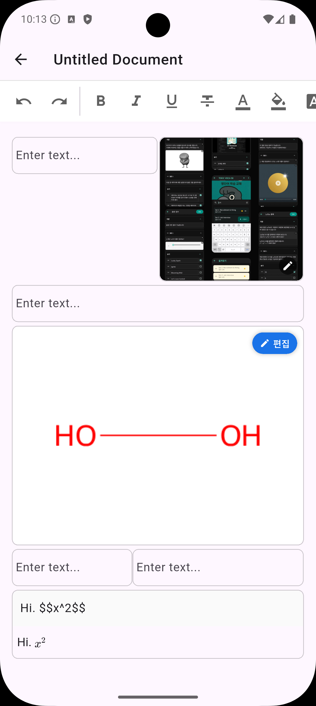
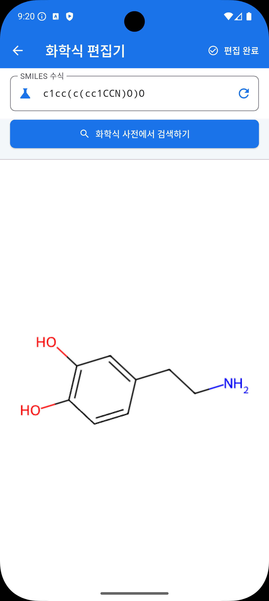
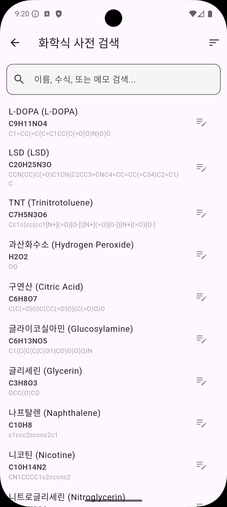
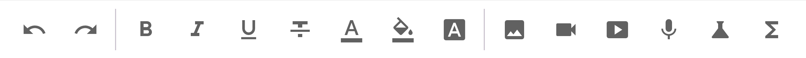

# App Document (문서 편집기)

Antigravity를 활용했습니다.  
이 프로젝트는 Flutter 프레임워크를 기반으로 구축된 문서 편집 애플리케이션입니다.

본 프로젝트는 현재 실험적인 단계에 있으며, 코드의 모든 부분이 완벽하게 검증되지는 않았습니다.  
기능상의 미흡함이 있을 수 있음을 미리 알려드리며, 지속적인 개선을 목표로 하고 있습니다.

## 시작하기

이 프로젝트를 로컬 환경에서 실행하기 위한 절차는 다음과 같습니다.

1.  의존성 패키지 설치:
    ```bash
    flutter pub get
    ```
2.  응용 프로그램 실행:
    ```bash
    flutter run
    ```

## 커스텀 리치 텍스트 에디터 아키텍처

이 프로젝트의 핵심은 직접 설계하고 구현한 세그먼트 기반 리치 텍스트 에디터입니다.  
기성 패키지를 단순히 활용하는 대신, 문서의 복잡한 구조를 제어하기 위해 다음과 같은 기술적 특징을 갖추고 있습니다.

### 1. 세그먼트 기반 아키텍처 (Segment-based Architecture)
문서의 각 텍스트 조각을 스타일 정보를 포함한 독립적인 세그먼트(TextSegment) 객체로 관리합니다.  
이를 통해 글자 단위의 정밀한 스타일 제어가 가능하며, 복잡한 스타일 변경 시에도 문서의 논리적 구조를 안정적으로 유지합니다.

### 2. 이중 컨트롤러 동기화 (Dual-Controller Sync)
상위 수준의 JSON 직렬화 데이터를 관리하는 외부 컨트롤러와 실제 세그먼트 로직을 처리하는 내부 컨트롤러가 양방향으로 동기화됩니다.  
이 구조는 안정적인 데이터 저장 및 불러오기 기능을 보장하는 메커니즘입니다.

## 주요 기능 및 스크린샷

### 문서 편집 인터페이스
문서의 본문을 작성하고 다양한 서식을 적용할 수 있는 기본 화면입니다.  
<br>


### SMILES 기반 화학 구조식 렌더링
SMILES 표기법을 실시간으로 시각화하여 화학 구조식으로 변환해 보여주는 기능을 지원합니다.  
<br>


### 화학식 라이브러리 및 검색
자주 사용하는 화학식들을 저장하고 관리할 수 있는 라이브러리 인터페이스입니다.  
<br>


### 편집 도구 모음
직관적인 기능을 제공하는 텍스트 편집용 하단 툴바입니다.  
<br>


